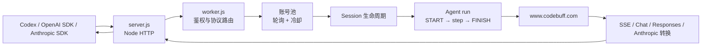

# 当前架构

## 定位

这是运行在自有 VPS 上的 Node.js 协议适配器：

- 对外提供 OpenAI Chat Completions、OpenAI Responses 和 Anthropic Messages 接口。
- 对内调用 Freebuff/Codebuff 的 session、agent run 和 chat 接口。
- 支持多个用户已配置账号的稳定轮询。
- 它不是完整 Freebuff CLI，不在服务端执行官方15个本地工具。

## 请求链



## 核心模块

| 模块 | 文件 | 职责 |
|---|---|---|
| VPS HTTP | `server.js` | Web Request/Response 桥接、断连取消、退出清理 |
| API 适配器 | `worker.js` | 路由、鉴权、账号池、session、agent run、协议转换 |
| 单元测试 | `test/worker.test.mjs` | mock 上游验证协议、错误处理和轮询 |
| 端到端测试 | `test/e2e-local.mjs` | 启动真实 Node 服务和本地 mock 上游 |
| 逆向证据 | `artifacts/reverse/` | 样本哈希、偏移、运行统计、E2E 结果 |
| 逆向文档 | `docs/reverse/CLI-0.0.149.md` | 官方 CLI 证据和仍未知部分 |

## 运行时状态

以下状态只保存在单个 Node 进程内：

- 账号轮询游标
- 账号/模型冷却时间
- 每账号、每模型 session 缓存
- 当前进程被 supersede 的账号
- Responses `previous_response_id` 到 `trace_session_id` 的映射
- 已观察到的账号健康和 access tier

因此应在 VPS 上运行**单实例**。多进程或多副本之间没有共享状态。

## 多账号算法

配置顺序为 `A,B,C` 时，请求顺序为：

```text
A → B → C → A → B → C
```

规则：

1. 每个请求从全局轮询游标选择下一个账号。
2. 同一次请求不会重复选择已失败账号。
3. 每个账号分别复用自己的模型 session。
4. 429、账号错误或临时上游错误可以切换账号。
5. 冷却按“账号 + 模型”记录，并使用 `retryAfterMs`/`resetAt`。
6. 外部进程持有的 active session 不会被删除或 takeover。
7. session gate 使用 HTTP 状态和顶层错误码双重匹配，匹配后原样返回。

## 并发设计

Freebuff 免费通道不适合并发推理。当前实现：

- session/run 短请求通过队列串行并留出小间隔。
- 完整 chat stream 占用全局推理锁，直到 SSE 读取结束。
- 下游断开会中止上游请求并以 cancelled 结束 run。

## 进程退出

`server.js` 捕获 `SIGINT` 和 `SIGTERM`：

1. 停止接收新请求。
2. 等待 HTTP 服务关闭。
3. DELETE 当前进程明确持有的 session。
4. 不处理其他客户端的 session。
